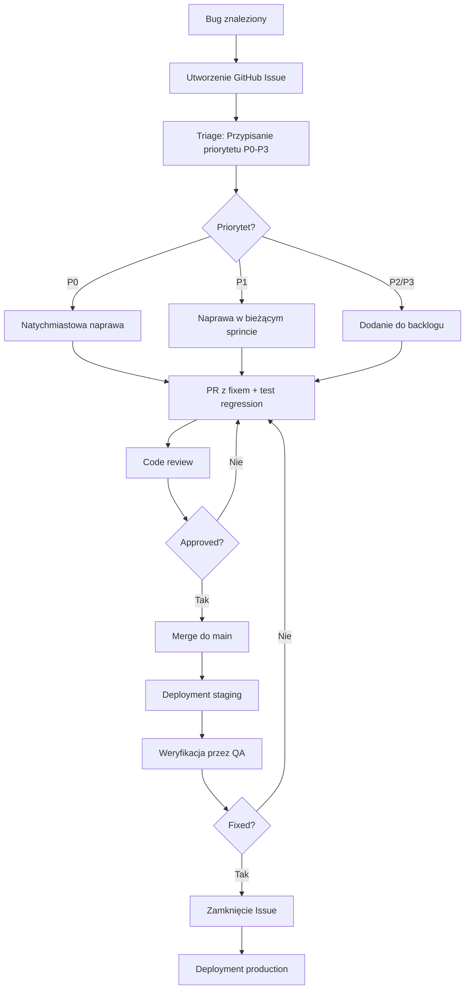

# Plan Testów - MroczneHistorie

## 1. Wprowadzenie i cele testowania

### 1.1 Cel dokumentu
Niniejszy plan testów definiuje kompleksową strategię testowania aplikacji **MroczneHistorie** - mobilnej aplikacji webowej do generowania zagadek w stylu "Czarnych Historii" z wykorzystaniem sztucznej inteligencji (OpenAI GPT-4o).

### 1.2 Cele testowania
- **Weryfikacja funkcjonalności MVP**: Potwierdzenie, że wszystkie kluczowe funkcjonalności działają zgodnie z wymaganiami (generowanie historii, CRUD, autentykacja)
- **Zapewnienie bezpieczeństwa**: Walidacja polityk RLS, autentykacji i autoryzacji użytkowników
- **Gwarancja jakości integracji z OpenAI**: Testowanie stabilności i obsługi błędów zewnętrznego API (timeout, rate limiting)
- **Weryfikacja UX mobile-first**: Potwierdzenie responsywności i użyteczności na urządzeniach mobilnych
- **Walidacja integralności danych**: Sprawdzenie poprawności walidacji Zod i ochrony przed błędnymi danymi
- **Przygotowanie do produkcji**: Identyfikacja i eliminacja krytycznych błędów przed uruchomieniem MVP

### 1.3 Zakres MVP
Aplikacja służy do szybkiej walidacji hipotezy biznesowej: **Czy użytkownicy widzą wartość w asystencie AI do tworzenia mrocznych historii i czy będą z niego regularnie korzystać?**

---

## 2. Zakres testów

### 2.1 Obszary objęte testami

#### 2.1.1 Backend API (6 endpointów)
- ✅ `POST /api/stories/generate` - Generowanie historii przez AI
- ✅ `POST /api/stories` - Zapisywanie historii do bazy
- ✅ `GET /api/stories` - Lista historii z paginacją
- ✅ `GET /api/stories/random` - Losowa historia
- ✅ `PATCH /api/stories/[id]` - Edycja historii
- ✅ `DELETE /api/stories/[id]` - Usuwanie historii

#### 2.1.2 Frontend (7 widoków)
- ✅ Landing Page / Lista historii (`/`)
- ✅ Logowanie (`/login`)
- ✅ Rejestracja (`/register`)
- ✅ Generowanie historii (`/generate`)
- ✅ Szczegóły historii - tryb gry (`/stories/[id]`)
- ✅ Edycja historii (`/stories/[id]/edit`)

#### 2.1.3 Komponenty UI (11 komponentów)
- EmptyState, FormField, GlobalLoader, LandingPage, ModalConfirmDelete, Navbar, ReadOnlyField, StoryCard, StoryList, SubmitButton, ToastContainer

#### 2.1.4 Autentykacja i autoryzacja
- ✅ Supabase Auth (rejestracja, logowanie, wylogowanie)
- ✅ Row Level Security (RLS) policies
- ✅ Bearer token (API) + Cookie session (browser)
- ✅ Ochrona routes dla niezalogowanych użytkowników

#### 2.1.5 Integracja z OpenAI
- ✅ Generowanie historii (GPT-4o)
- ✅ Obsługa timeout (45s)
- ✅ Obsługa rate limiting (HTTP 429)
- ✅ Obsługa błędów API (5xx, 4xx)

#### 2.1.6 Baza danych
- ✅ Tabela `stories` (CRUD operations)
- ✅ Funkcja PostgreSQL `get_random_story()`
- ✅ Migracje bazy danych
- ✅ Indeksy i optymalizacja zapytań

### 2.2 Obszary wyłączone z testów
- ❌ Supabase internals (zarządzana usługa, pokryta testami vendor)
- ❌ OpenAI API internals (zewnętrzna zależność, pokryta testami OpenAI)
- ❌ Tailwind CSS / DaisyUI framework (biblioteki third-party)
- ❌ Node.js / SvelteKit internals (framework testowany przez maintainerów)

---

## 3. Typy testów do przeprowadzenia

### 3.1 Testy End-to-End (E2E) - **Playwright**
**Priorytet: KRYTYCZNY (P0)**

#### 3.1.1 Cel
Weryfikacja kompletnych user flows od początku do końca, symulujących rzeczywiste interakcje użytkownika z aplikacją.

#### 3.1.2 Środowisko
- **Framework**: Playwright
- **Browser**: Chromium/Desktop Chrome (zgodnie z wytycznymi projektu)
- **Viewport**: Mobile-first (375x667px) + Desktop (1920x1080px)

#### 3.1.3 Obszary testowania
- Pełne user flows (rejestracja → logowanie → generowanie → zapis → edycja → usunięcie)
- Nawigacja między widokami
- Form submissions z progressive enhancement
- Toast notifications
- Modal dialogs
- Loading states (GlobalLoader, SubmitButton)
- Responsywność (mobile + desktop)

---

### 3.2 Testy API (Integration Tests)
**Priorytet: KRYTYCZNY (P0)**

#### 3.2.1 Cel
Weryfikacja poprawności działania wszystkich endpointów API, walidacji danych, autoryzacji i obsługi błędów.

#### 3.2.2 Narzędzia
- Playwright API testing (`request` fixture)
- Możliwość rozszerzenia: Vitest + Supertest (dla testów jednostkowych API)

#### 3.2.3 Obszary testowania
- Wszystkie 6 endpointów API
- HTTP status codes (200, 201, 204, 400, 401, 403, 404, 408, 503)
- Request/response body validation
- Query parameters (limit, offset)
- Path parameters (UUID validation)
- Authentication (Bearer token, cookie session)
- Authorization (RLS policies)
- Error handling (błędne dane, missing fields, invalid JSON)

---

### 3.3 Testy bezpieczeństwa
**Priorytet: KRYTYCZNY (P0)**

#### 3.3.1 Cel
Zapewnienie ochrony danych użytkowników i systemu przed atakami.

#### 3.3.2 Obszary testowania

**Autentykacja i autoryzacja:**
- Weryfikacja RLS policies (użytkownik widzi tylko swoje historie)
- Próby dostępu do cudzych zasobów (UUID enumeration)
- Próby operacji bez tokenu autentykacji
- Session expiration i refresh

**Injection attacks:**
- SQL Injection w polach: subject, question, answer
- XSS (Cross-Site Scripting) w user-generated content
- Command injection (jeśli aplikowalne)

**Walidacja danych:**
- Bypass walidacji Zod (manipulacja request body)
- Boundary testing (max length, min length)
- Invalid data types (string zamiast number, etc.)

**Rate limiting i DoS:**
- Symulacja wielu równoczesnych requestów do OpenAI
- Brute force protection (logowanie)

---

### 3.4 Testy walidacji danych
**Priorytet: WYSOKI (P1)**

#### 3.4.1 Cel
Weryfikacja poprawności wszystkich schematów walidacji Zod i obsługi błędów walidacji.

#### 3.4.2 Schematy do przetestowania
- `GenerateStorySchema` (subject, difficulty, darkness)
- `CreateStorySchema` (extends GenerateStorySchema + question, answer)
- `UpdateStorySchema` (question?, answer? - przynajmniej jedno wymagane)
- `ListStoriesQueryParamsSchema` (limit, offset)

#### 3.4.3 Scenariusze testowe
- **Happy path**: Poprawne dane
- **Boundary testing**: 0, 1, 150, 151 znaków dla subject
- **Missing fields**: Brak wymaganych pól
- **Invalid types**: String zamiast number, null zamiast string
- **Edge cases**: Emoji, znaki specjalne, Unicode, HTML tags
- **Empty strings**: "", "   " (whitespace only)
- **SQL injection payloads**: `'; DROP TABLE stories; --`
- **XSS payloads**: `<script>alert('XSS')</script>`

---

### 3.5 Testy integracji z OpenAI
**Priorytet: WYSOKI (P1)**

#### 3.5.1 Cel
Weryfikacja stabilności integracji z zewnętrznym API OpenAI i obsługi błędów.

#### 3.5.2 Scenariusze testowe

**Happy path:**
- Poprawne generowanie historii z różnymi parametrami (difficulty: 1-3, darkness: 1-3)
- Parsowanie odpowiedzi JSON z polami `question` i `answer`

**Error handling:**
- **Timeout**: Symulacja przekroczenia 45s (AbortError → TimeoutError 408)
- **Rate limiting**: HTTP 429 → RateLimitError 503
- **Server errors**: HTTP 500, 502, 503 → ExternalApiError 503
- **Invalid API key**: HTTP 401
- **Malformed response**: Niepoprawny JSON, brak pól question/answer
- **Network errors**: Connection refused, DNS failure

**Edge cases:**
- Bardzo długi subject (150 znaków)
- Subject z emoji i znakami specjalnymi
- Różne kombinacje difficulty x darkness (9 kombinacji)

#### 3.5.3 Mockowanie
**KRYTYCZNE**: Testy integracji z OpenAI **MUSZĄ** używać mocków, aby:
- Uniknąć kosztów API (każde wywołanie kosztuje)
- Zapewnić deterministyczne wyniki testów
- Umożliwić testowanie scenariuszy błędów (timeout, rate limit)

**Narzędzia mockowania**:
- Playwright route interception (`page.route()`)
- MSW (Mock Service Worker) dla testów jednostkowych

---

### 3.6 Testy UI/UX (responsywność i dostępność)
**Priorytet: ŚREDNI (P2)**

#### 3.6.1 Cel
Weryfikacja poprawności interfejsu użytkownika na różnych urządzeniach i zapewnienie dostępności.

#### 3.6.2 Responsywność (Mobile-first)

**Viewports do przetestowania:**
- **Mobile**: 375x667px (iPhone SE)
- **Mobile Large**: 414x896px (iPhone 11 Pro Max)
- **Tablet**: 768x1024px (iPad)
- **Desktop**: 1920x1080px

**Scenariusze:**
- Navbar: Hamburger menu na mobile, full menu na desktop
- StoryCard: Pojedyncza kolumna na mobile, grid na desktop
- FormField: Full width na mobile, ograniczona szerokość na desktop
- Modal: Pełnoekranowy na mobile, centered na desktop

#### 3.6.3 Dostępność (Accessibility)

**Testy podstawowe:**
- Keyboard navigation (Tab, Enter, Escape)
- Focus indicators (outline visible)
- ARIA labels i roles
- Semantic HTML (heading hierarchy)
- Color contrast (WCAG 2.1 AA - szczególnie w dark mode)

**Narzędzia:**
- Playwright accessibility testing (`expect(page).toHaveAccessibleName()`)
- Axe-core integration (możliwe rozszerzenie)

#### 3.6.4 Visual Regression Testing

**Cel**: Wykrywanie nieplanowanych zmian wizualnych

**Narzędzia:**
- Playwright screenshots (`expect(page).toHaveScreenshot()`)

**Scenariusze:**
- Wszystkie główne widoki (landing, login, register, generate, list, details, edit)
- Komponenty w różnych stanach (loading, error, success)
- Dark mode (jedyny motyw)

---

### 3.7 Testy wydajnościowe
**Priorytet: NISKI (P3)**

#### 3.7.1 Cel
Zapewnienie akceptowalnych czasów odpowiedzi i stabilności pod obciążeniem.

#### 3.7.2 Metryki

**Backend API:**
- Czas odpowiedzi < 200ms dla CRUD operations (bez OpenAI)
- Czas odpowiedzi < 45s dla `/api/stories/generate` (OpenAI timeout)
- Throughput: 10 równoczesnych użytkowników

**Frontend:**
- Time to First Byte (TTFB) < 500ms
- First Contentful Paint (FCP) < 1.5s
- Largest Contentful Paint (LCP) < 2.5s
- Time to Interactive (TTI) < 3s

**Database:**
- Query execution time < 50ms (lista historii z paginacją)
- Index effectiveness (EXPLAIN ANALYZE)

#### 3.7.3 Narzędzia
- Playwright performance timing API
- Lighthouse CI (możliwe rozszerzenie)
- k6 lub Artillery (load testing - opcjonalnie dla skalowania poza MVP)

---

## 4. Scenariusze testowe dla kluczowych funkcjonalności

### 4.1 Epic: Autentykacja i autoryzacja

#### TC-AUTH-001: Rejestracja nowego użytkownika (Happy Path)
**Priorytet**: P0
**Typ**: E2E

**Kroki:**
1. Przejdź do `/register`
2. Wprowadź poprawny email: `test@example.com`
3. Wprowadź hasło: `SecurePass123!` (min 6 znaków)
4. Wprowadź potwierdzenie hasła: `SecurePass123!`
5. Kliknij "Zarejestruj się"

**Oczekiwany rezultat:**
- Przekierowanie do `/` (lista historii)
- Toast success: "Rejestracja zakończona sukcesem"
- Navbar pokazuje "Wyloguj się" i "Generuj"
- Użytkownik jest zalogowany (session cookie)

---

#### TC-AUTH-002: Rejestracja - walidacja formularza
**Priorytet**: P1
**Typ**: E2E

**Scenariusze błędów:**

| Scenariusz         | Email              | Hasło             | Oczekiwany błąd                |
|--------------------|--------------------|-------------------|--------------------------------|
| Pusty email        | ``                 | `SecurePass123!`  | "Email jest wymagany"          |
| Niepoprawny email  | `invalid-email`    | `SecurePass123!`  | "Niepoprawny format email"     |
| Zbyt krótkie hasło | `test@example.com` | `123`             | "Hasło musi mieć min 6 znaków" |
| Hasła nie pasują   | `test@example.com` | `Pass1` / `Pass2` | "Hasła muszą być identyczne"   |

---

#### TC-AUTH-003: Logowanie (Happy Path)
**Priorytet**: P0
**Typ**: E2E

**Warunki wstępne**: Użytkownik już zarejestrowany

**Kroki:**
1. Przejdź do `/login`
2. Wprowadź email: `test@example.com`
3. Wprowadź hasło: `SecurePass123!`
4. Kliknij "Zaloguj się"

**Oczekiwany rezultat:**
- Przekierowanie do `/` (lista historii lub landing page)
- Toast success: "Zalogowano pomyślnie"
- Navbar pokazuje "Wyloguj się"

---

#### TC-AUTH-004: Logowanie - niepoprawne dane
**Priorytet**: P1
**Typ**: E2E

**Scenariusze:**
- **Niepoprawne hasło**: Toast error: "Niepoprawny email lub hasło"
- **Nieistniejący użytkownik**: Toast error: "Niepoprawny email lub hasło"
- **Puste pola**: Walidacja inline, disabled submit button

---

#### TC-AUTH-005: Wylogowanie
**Priorytet**: P0
**Typ**: E2E

**Warunki wstępne**: Użytkownik zalogowany

**Kroki:**
1. Kliknij "Wyloguj się" w Navbar
2. Potwierdź wylogowanie (jeśli modal)

**Oczekiwany rezultat:**
- Przekierowanie do `/` (landing page dla niezalogowanych)
- Session cookie usunięte
- Navbar pokazuje "Zaloguj się" i "Zarejestruj się"

---

#### TC-AUTH-006: Ochrona route - brak autentykacji
**Priorytet**: P0
**Typ**: E2E

**Scenariusze:**

| Route                | Oczekiwana akcja           |
|----------------------|----------------------------|
| `/generate`          | Przekierowanie do `/login` |
| `/stories`           | Przekierowanie do `/login` |
| `/stories/[id]`      | Przekierowanie do `/login` |
| `/stories/[id]/edit` | Przekierowanie do `/login` |

---

#### TC-AUTH-007: RLS - użytkownik widzi tylko swoje historie (API)
**Priorytet**: P0
**Typ**: API + Security

**Warunki wstępne:**
- Użytkownik A: `user-a@example.com` z historiami `story-a-1`, `story-a-2`
- Użytkownik B: `user-b@example.com` z historiami `story-b-1`

**Scenariusze:**

| Request | User | Endpoint                 | Oczekiwany rezultat            |
|---------|------|--------------------------|--------------------------------|
| GET     | A    | `/api/stories`           | Tylko `story-a-1`, `story-a-2` |
| GET     | B    | `/api/stories`           | Tylko `story-b-1`              |
| GET     | A    | `/api/stories/story-b-1` | 404 Not Found (RLS blokuje)    |
| PATCH   | A    | `/api/stories/story-b-1` | 404 Not Found (RLS blokuje)    |
| DELETE  | A    | `/api/stories/story-b-1` | 404 Not Found (RLS blokuje)    |

---

### 4.2 Epic: Generowanie historii (Core Feature MVP)

#### TC-GEN-001: Generowanie historii (Happy Path)
**Priorytet**: P0
**Typ**: E2E

**Warunki wstępne**: Użytkownik zalogowany

**Kroki:**
1. Przejdź do `/generate`
2. Wprowadź subject: `Tajemnicza śmierć w bibliotece`
3. Wybierz difficulty: `2` (slider lub select)
4. Wybierz darkness: `2` (slider lub select)
5. Kliknij "Wygeneruj historię"
6. Poczekaj na GlobalLoader (max 45s)
7. Weryfikuj wyświetlenie podglądu z pytaniem i odpowiedzią
8. Kliknij "Zapisz na mojej liście"

**Oczekiwany rezultat:**
- GlobalLoader pokazuje "Tworzymy Twoją mroczną historię..."
- Po wygenerowaniu: podgląd z pytaniem i odpowiedzią
- Toast success: "Historia zapisana pomyślnie"
- Przekierowanie do `/` (lista historii)
- Nowa historia widoczna na liście (sortowanie: created_at DESC)

---

#### TC-GEN-002: Generowanie historii - przycisk "Losuj" dla subject
**Priorytet**: P1
**Typ**: E2E

**Kroki:**
1. Przejdź do `/generate`
2. Kliknij przycisk "Losuj" obok pola subject
3. Weryfikuj, że pole subject zostało wypełnione losowym słowem
4. Kliknij "Losuj" ponownie
5. Weryfikuj, że subject zmienił się na inne losowe słowo

**Oczekiwany rezultat:**
- Pole subject wypełnione jednym z 50 predefiniowanych słów
- Każde kliknięcie daje nowe losowe słowo

---

#### TC-GEN-003: Generowanie historii - walidacja formularza
**Priorytet**: P1
**Typ**: E2E

**Scenariusze błędów:**

| Scenariusz              | Subject         | Difficulty | Darkness | Oczekiwany błąd            |
|-------------------------|-----------------|------------|----------|----------------------------|
| Pusty subject           | ``              | 2          | 2        | "Subject jest wymagany"    |
| Subject za długi        | `${151 znaków}` | 2          | 2        | "Maksymalnie 150 znaków"   |
| Brak difficulty         | `Test`          | null       | 2        | "Difficulty jest wymagane" |
| Difficulty out of range | `Test`          | 4          | 2        | "Difficulty musi być 1-3"  |

---

#### TC-GEN-004: Generowanie historii - timeout (45s)
**Priorytet**: P0
**Typ**: API + E2E

**Mockowanie**: Symulacja opóźnienia > 45s w OpenAI API

**Kroki:**
1. Przejdź do `/generate`
2. Wypełnij formularz
3. Kliknij "Wygeneruj historię"
4. Poczekaj 45s (mock delay)

**Oczekiwany rezultat:**
- GlobalLoader widoczny przez 45s
- Po 45s: Toast error: "Przekroczono limit czasu generowania (45s). Spróbuj ponownie."
- HTTP status: 408 Request Timeout
- Formularz nadal wypełniony (dane nie zginęły)

---

#### TC-GEN-005: Generowanie historii - rate limiting (HTTP 429)
**Priorytet**: P1
**Typ**: API

**Mockowanie**: OpenAI zwraca HTTP 429

**Request:**
```json
POST /api/stories/generate
{
  "subject": "Test",
  "difficulty": 2,
  "darkness": 2
}
```

**Oczekiwany rezultat:**
- HTTP status: 503 Service Unavailable
- Response body:
```json
{
  "error": {
    "code": "RATE_LIMIT_ERROR",
    "message": "Zewnętrzne API jest chwilowo niedostępne (rate limit). Spróbuj ponownie za chwilę."
  }
}
```
- Toast error z tym komunikatem

---

#### TC-GEN-006: Generowanie historii - błąd OpenAI API (5xx)
**Priorytet**: P1
**Typ**: API

**Mockowanie**: OpenAI zwraca HTTP 503

**Oczekiwany rezultat:**
- HTTP status: 503 Service Unavailable
- Response body:
```json
{
  "error": {
    "code": "EXTERNAL_API_ERROR",
    "message": "Zewnętrzne API jest chwilowo niedostępne. Spróbuj ponownie później."
  }
}
```

---

#### TC-GEN-007: Generowanie historii - niepoprawna odpowiedź OpenAI
**Priorytet**: P1
**Typ**: API

**Mockowanie**: OpenAI zwraca JSON bez pól `question` lub `answer`

**Oczekiwany rezultat:**
- HTTP status: 500 Internal Server Error
- Response body:
```json
{
  "error": {
    "code": "GENERATION_ERROR",
    "message": "Nie udało się wygenerować historii. Spróbuj ponownie."
  }
}
```

---

#### TC-GEN-008: Generowanie historii - "Wygeneruj ponownie"
**Priorytet**: P1
**Typ**: E2E

**Warunki wstępne**: Historia wygenerowana, podgląd widoczny

**Kroki:**
1. Kliknij "Wygeneruj ponownie"
2. Weryfikuj GlobalLoader
3. Weryfikuj nową wygenerowaną historię (różne pytanie/odpowiedź)

**Oczekiwany rezultat:**
- Stara historia **NIE** została zapisana do bazy
- Nowa historia wygenerowana z tymi samymi parametrami (subject, difficulty, darkness)
- Podgląd zaktualizowany

---

#### TC-GEN-009: Generowanie historii - edge cases dla subject
**Priorytet**: P2
**Typ**: API

**Scenariusze:**

| Subject                              | Oczekiwany rezultat             |
|--------------------------------------|---------------------------------|
| `Test 😀 emoji`                      | Historia wygenerowana poprawnie |
| `Test <script>alert('XSS')</script>` | Escaped, historia wygenerowana  |
| `Test'; DROP TABLE stories; --`      | Escaped, historia wygenerowana  |
| `Test łąćźńó` (polskie znaki)        | Historia wygenerowana poprawnie |
| `${"a".repeat(150)}` (max length)    | Historia wygenerowana poprawnie |

---

### 4.3 Epic: Zarządzanie historiami (CRUD)

#### TC-CRUD-001: Lista historii - pusty stan (Empty State)
**Priorytet**: P1
**Typ**: E2E

**Warunki wstępne**: Użytkownik zalogowany, brak zapisanych historii

**Kroki:**
1. Przejdź do `/`

**Oczekiwany rezultat:**
- Komponent EmptyState widoczny
- Tekst: "Twoja księga mrocznych historii jest jeszcze pusta..."
- Przycisk "Stwórz pierwszą historię" → link do `/generate`
- Przycisk "Losuj" jest **disabled** (brak historii do losowania)

---

#### TC-CRUD-002: Lista historii (Happy Path)
**Priorytet**: P0
**Typ**: E2E

**Warunki wstępne**: Użytkownik ma 3 zapisane historie

**Kroki:**
1. Przejdź do `/`

**Oczekiwany rezultat:**
- Lista StoryCard komponentów (3 karty)
- Sortowanie: created_at DESC (najnowsze na górze)
- Każda karta zawiera:
  - Pytanie (question) - skrócone jeśli za długie
  - Trudność: "T: X" (1-3)
  - Mroczność: "M: X" (1-3)
  - Ikona edycji (link do `/stories/[id]/edit`)
  - Ikona usuwania (otwiera modal)
- Przycisk "Losuj" jest **enabled**

---

#### TC-CRUD-003: Lista historii - paginacja
**Priorytet**: P2
**Typ**: API

**Warunki wstępne**: Użytkownik ma 50 zapisanych historii

**Request:**
```http
GET /api/stories?limit=25&offset=0
```

**Oczekiwany rezultat:**
- HTTP status: 200 OK
- Response body:
```json
{
  "stories": [ /* 25 historii */ ],
  "total": 50
}
```

**Request 2:**
```http
GET /api/stories?limit=25&offset=25
```

**Oczekiwany rezultat:**
- HTTP status: 200 OK
- Response body:
```json
{
  "stories": [ /* kolejne 25 historii */ ],
  "total": 50
}
```

**Edge cases:**
- `limit=0` → 400 Bad Request
- `limit=101` → 400 Bad Request (max 100)
- `offset=-1` → 400 Bad Request
- `offset=1000` (większy niż total) → 200 OK z pustą tablicą stories

---

#### TC-CRUD-004: Losowa historia (Happy Path)
**Priorytet**: P1
**Typ**: E2E + API

**Warunki wstępne**: Użytkownik ma 10 zapisanych historii

**Kroki (E2E):**
1. Przejdź do `/`
2. Kliknij przycisk "Losuj"

**Oczekiwany rezultat:**
- Przekierowanie do `/stories/[random-id]`
- Widoczne pytanie losowej historii
- Przycisk "Odkryj odpowiedź"

**Kroki (API):**
```http
GET /api/stories/random
Authorization: Bearer {token}
```

**Oczekiwany rezultat:**
- HTTP status: 200 OK
- Response body: pojedyncza `StoryDTO`
- Historia należy do zalogowanego użytkownika
- Każde wywołanie może zwrócić inną historię (randomizacja)

---

#### TC-CRUD-005: Losowa historia - brak historii
**Priorytet**: P1
**Typ**: API

**Warunki wstępne**: Użytkownik nie ma żadnych historii

**Request:**
```http
GET /api/stories/random
```

**Oczekiwany rezultat:**
- HTTP status: 404 Not Found
- Response body:
```json
{
  "error": {
    "code": "NOT_FOUND",
    "message": "Nie znaleziono żadnej historii."
  }
}
```

---

#### TC-CRUD-006: Szczegóły historii - tryb gry (Happy Path)
**Priorytet**: P0
**Typ**: E2E

**Warunki wstępne**: Użytkownik ma historię o ID `story-123`

**Kroki:**
1. Przejdź do `/stories/story-123`
2. Weryfikuj wyświetlenie pytania
3. Weryfikuj, że odpowiedź jest **ukryta**
4. Kliknij "Odkryj odpowiedź"
5. Weryfikuj wyświetlenie odpowiedzi
6. Kliknij "Ukryj odpowiedź"
7. Weryfikuj, że odpowiedź jest ponownie **ukryta**

**Oczekiwany rezultat:**
- Minimalistyczny interfejs (bez Navbar? zgodnie z PRD "ultra-prosty widok")
- Pytanie widoczne od razu
- Odpowiedź ukryta domyślnie
- Toggle "Odkryj odpowiedź" / "Ukryj odpowiedź" działa

---

#### TC-CRUD-007: Szczegóły historii - niepoprawne ID
**Priorytet**: P1
**Typ**: E2E + API

**Scenariusze:**

| ID                                                                | Oczekiwany rezultat                              |
|-------------------------------------------------------------------|--------------------------------------------------|
| `invalid-uuid`                                                    | 400 Bad Request: "Niepoprawny format UUID"       |
| `00000000-0000-0000-0000-000000000000` (valid UUID, nie istnieje) | 404 Not Found: "Historia nie została znaleziona" |
| `{cudze-story-id}` (UUID historii innego użytkownika)             | 404 Not Found (RLS blokuje)                      |

---

#### TC-CRUD-008: Edycja historii (Happy Path)
**Priorytet**: P0
**Typ**: E2E

**Warunki wstępne**: Użytkownik ma historię `story-123`

**Kroki:**
1. Przejdź do `/stories/story-123/edit`
2. Weryfikuj pola read-only: subject, difficulty, darkness (nie edytowalne)
3. Zmodyfikuj pytanie: `Nowe pytanie testowe`
4. Zmodyfikuj odpowiedź: `Nowa odpowiedź testowa`
5. Kliknij "Zapisz zmiany"

**Oczekiwany rezultat:**
- Toast success: "Historia zaktualizowana pomyślnie"
- Przekierowanie do `/stories/story-123` (szczegóły)
- Nowe pytanie i odpowiedź widoczne
- Pola read-only **NIE** zmieniły się

---

#### TC-CRUD-009: Edycja historii - walidacja
**Priorytet**: P1
**Typ**: API

**Scenariusze błędów:**

| Question           | Answer     | Oczekiwany błąd                                    |
|--------------------|------------|----------------------------------------------------|
| `` (empty)         | `Answer`   | 400: "Pytanie nie może być puste"                  |
| `Question`         | `` (empty) | 400: "Odpowiedź nie może być pusta"                |
| `` (empty)         | `` (empty) | 400: "Przynajmniej jedno pole musi być wypełnione" |
| `   ` (whitespace) | `Answer`   | 400: "Pytanie nie może być puste" (trim)           |

**Happy path edge case:**
- **Tylko question zmienione**: 200 OK, answer pozostaje niezmieniona
- **Tylko answer zmienione**: 200 OK, question pozostaje niezmienione

---

#### TC-CRUD-010: Usuwanie historii (Happy Path)
**Priorytet**: P0
**Typ**: E2E

**Warunki wstępne**: Użytkownik ma historię `story-123` na liście

**Kroki:**
1. Przejdź do `/` (lista historii)
2. Kliknij ikonę usuwania na karcie historii
3. Weryfikuj otwarcie modalu ModalConfirmDelete
4. Weryfikuj tekst: "Czy na pewno chcesz usunąć tę historię?"
5. Kliknij "Usuń"

**Oczekiwany rezultat:**
- Modal zamknięty
- Toast success: "Historia usunięta pomyślnie"
- Historia zniknęła z listy (bez reload strony)
- HTTP DELETE `/api/stories/story-123` zwraca 204 No Content

---

#### TC-CRUD-011: Usuwanie historii - anulowanie
**Priorytet**: P2
**Typ**: E2E

**Kroki:**
1. Kliknij ikonę usuwania
2. Weryfikuj modal otwarty
3. Kliknij "Anuluj" (lub `Esc` na klawiaturze)

**Oczekiwany rezultat:**
- Modal zamknięty
- Historia **NIE** została usunięta
- Brak toasta
- Brak wywołania API DELETE

---

#### TC-CRUD-012: Usuwanie historii - RLS security
**Priorytet**: P0
**Typ**: API + Security

**Warunki wstępne**:
- Użytkownik A ma historię `story-a-123`
- Użytkownik B próbuje usunąć `story-a-123`

**Request (User B):**
```http
DELETE /api/stories/story-a-123
Authorization: Bearer {user-b-token}
```

**Oczekiwany rezultat:**
- HTTP status: 404 Not Found (RLS blokuje, nie ujawnia że zasób istnieje)
- Historia `story-a-123` **NIE** została usunięta z bazy

---

### 4.4 Epic: UI Components

#### TC-UI-001: Toast notifications - success
**Priorytet**: P2
**Typ**: E2E

**Kroki:**
1. Wykonaj akcję sukcesu (np. zapis historii)
2. Weryfikuj wyświetlenie toasta typu "success"
3. Weryfikuj auto-dismiss po 5 sekundach

**Oczekiwany rezultat:**
- Toast z zieloną ikoną (DaisyUI alert-success)
- Tekst komunikatu widoczny
- Pozycja: top-right corner
- Auto-dismiss: 5s
- Możliwość manualnego zamknięcia (X button)

---

#### TC-UI-002: Toast notifications - error
**Priorytet**: P2
**Typ**: E2E

**Kroki:**
1. Wykonaj akcję błędu (np. błąd walidacji)
2. Weryfikuj wyświetlenie toasta typu "error"

**Oczekiwany rezultat:**
- Toast z czerwoną ikoną (DaisyUI alert-error)
- Auto-dismiss: 5s

---

#### TC-UI-003: Toast notifications - multiple toasts
**Priorytet**: P3
**Typ**: E2E

**Kroki:**
1. Wywołaj szybko 3 różne akcje generujące toasty
2. Weryfikuj wyświetlenie 3 toastów jednocześnie

**Oczekiwany rezultat:**
- Wszystkie 3 toasty widoczne
- Ułożone pionowo (stack)
- Każdy ma własny timer 5s
- Nie nakładają się na siebie

---

#### TC-UI-004: GlobalLoader - podczas generowania
**Priorytet**: P1
**Typ**: E2E

**Kroki:**
1. Przejdź do `/generate`
2. Wypełnij formularz
3. Kliknij "Wygeneruj historię"
4. Weryfikuj GlobalLoader widoczny

**Oczekiwany rezultat:**
- Pełnoekranowy loader (overlay)
- Tekst: "Tworzymy Twoją mroczną historię..."
- Nawigacja **zablokowana** (nie można kliknąć linków)
- Kontent **zablokowany**
- Spinner animowany

---

#### TC-UI-005: SubmitButton - loading state
**Priorytet**: P2
**Typ**: E2E

**Kroki:**
1. Przejdź do formularza (np. `/generate`)
2. Kliknij submit button
3. Weryfikuj stan loading

**Oczekiwany rezultat:**
- Button disabled podczas loading
- Spinner wewnątrz buttona
- Tekst zmieniony na "Loading..." (opcjonalnie)
- Niemożliwe kliknięcie ponownie (double-submit prevention)

---

#### TC-UI-006: Navbar - authenticated user
**Priorytet**: P1
**Typ**: E2E

**Warunki wstępne**: Użytkownik zalogowany

**Kroki:**
1. Zaloguj się
2. Weryfikuj Navbar

**Oczekiwany rezultat (Desktop):**
- Link: "Moje Historie" (`/`)
- Link: "Generuj (+)" (`/generate`)
- Link: "Wyloguj się"

**Oczekiwany rezultat (Mobile):**
- Hamburger menu (collapsed)
- Po kliknięciu: menu rozwinięte z tymi samymi linkami

---

#### TC-UI-007: Navbar - unauthenticated user
**Priorytet**: P1
**Typ**: E2E

**Warunki wstępne**: Użytkownik niezalogowany

**Oczekiwany rezultat:**
- Link: "Zaloguj się" (`/login`)
- Link: "Zarejestruj się" (`/register`)
- **BRAK** linku "Generuj" i "Wyloguj się"

---

#### TC-UI-008: Modal - keyboard accessibility
**Priorytet**: P2
**Typ**: E2E + Accessibility

**Kroki:**
1. Otwórz ModalConfirmDelete
2. Naciśnij `Tab` - focus przechodzi na "Anuluj"
3. Naciśnij `Tab` - focus przechodzi na "Usuń"
4. Naciśnij `Escape` - modal zamknięty

**Oczekiwany rezultat:**
- Focus trap w modalu (Tab nie wychodzi poza modal)
- Escape zamyka modal
- Enter na focusowanym przycisku wykonuje akcję

---

### 4.5 Epic: Responsywność (Mobile-First)

#### TC-RESP-001: Landing Page - mobile (375px)
**Priorytet**: P2
**Typ**: Visual + E2E

**Viewport**: 375x667px (iPhone SE)

**Scenariusze:**
1. Przejdź do `/` (niezalogowany)
2. Weryfikuj:
   - Tekst "Zostań Mistrzem Mrocznych Historii" czytelny
   - Przyciski "Zaloguj się" i "Stwórz konto" full-width
   - Navbar collapsed (hamburger)
   - Brak horizontal scroll

**Oczekiwany rezultat:**
- Screenshot zgodny z oczekiwaniami (visual regression)

---

#### TC-RESP-002: Lista historii - mobile (375px)
**Priorytet**: P2
**Typ**: Visual + E2E

**Viewport**: 375x667px

**Scenariusze:**
1. Zaloguj się, przejdź do `/`
2. Weryfikuj:
   - StoryCard: pojedyncza kolumna (full-width)
   - Tekst pytania czytelny (nie obcięty)
   - Ikony edycji/usuwania dostępne (wystarczająco duże do kliknięcia)
   - Przycisk "Generuj" i "Losuj" full-width lub wycentrowane

---

#### TC-RESP-003: Formularz generowania - mobile (375px)
**Priorytet**: P1
**Typ**: E2E

**Viewport**: 375x667px

**Scenariusze:**
1. Przejdź do `/generate`
2. Weryfikuj:
   - FormField full-width
   - Labels czytelne
   - Inputs touch-friendly (min 44px wysokości)
   - Sliders (difficulty, darkness) łatwe do używania palcem

---

#### TC-RESP-004: Desktop - grid layout (1920px)
**Priorytet**: P3
**Typ**: Visual

**Viewport**: 1920x1080px

**Scenariusze:**
1. Przejdź do `/` (lista historii)
2. Weryfikuj:
   - StoryCard: grid 2-3 kolumny (zależnie od designu)
   - Formularz generate: max-width (nie full-screen)
   - Navbar: full menu (nie hamburger)

---

## 5. Środowisko testowe

### 5.1 Środowiska

#### 5.1.1 Development (Local)
- **URL**: `http://localhost:5173`
- **Backend**: SvelteKit dev server (`npm run dev`)
- **Database**: Supabase Local Dev (opcjonalnie) lub Supabase Cloud (dev project)
- **OpenAI**: Mocki (MSW) lub klucz API testowy (sandbox)
- **Cel**: Testy manualne przez deweloperów, szybki feedback

#### 5.1.2 Staging (Pre-production)
- **URL**: `https://staging.mrocznehistorie.app` (przykład)
- **Hosting**: Cloudflare Pages (preview deployment)
- **Database**: Supabase Cloud (staging project)
- **OpenAI**: Klucz API testowy (ograniczony quota)
- **Cel**: Testy E2E automatyczne (Playwright CI), testy akceptacyjne

#### 5.1.3 Production
- **URL**: `https://mrocznehistorie.app` (docelowy)
- **Hosting**: Cloudflare Pages
- **Database**: Supabase Cloud (production project)
- **OpenAI**: Klucz API produkcyjny
- **Cel**: Smoke tests po deploymencie, monitoring

---

### 5.2 Dane testowe

#### 5.2.1 Test users (Staging)

| Email                         | Hasło          | Role          | Liczba historii |
|-------------------------------|----------------|---------------|-----------------|
| `test-user-empty@example.com` | `TestPass123!` | Authenticated | 0 (empty state) |
| `test-user-few@example.com`   | `TestPass123!` | Authenticated | 5               |
| `test-user-many@example.com`  | `TestPass123!` | Authenticated | 50 (paginacja)  |

#### 5.2.2 Test stories (Seed data)

**Historia 1 (Prosta, niska mroczność):**
```json
{
  "subject": "Zaginiony klucz",
  "difficulty": 1,
  "darkness": 1,
  "question": "Znalazłem klucz w ogrodzie. Dlaczego wszyscy patrzą na mnie ze strachem?",
  "answer": "Klucz był do bramy cmentarza, która była zamknięta od 100 lat."
}
```

**Historia 2 (Trudna, wysoka mroczność):**
```json
{
  "subject": "Tajemnicze zdjęcie",
  "difficulty": 3,
  "darkness": 3,
  "question": "Na starym zdjęciu rodzinnym jest osoba, której nikt nie rozpoznaje. Kto to?",
  "answer": "To przyszła ofiara rodziny. Zdjęcie zrobiono dzień przed jej śmiercią, ale oni jeszcze nie wiedzieli, że ją zabiją."
}
```

#### 5.2.3 Seed script

**Lokalizacja**: `/tests/seed-data.ts` (do stworzenia)

**Funkcje:**
- `seedUsers()` - tworzenie test users
- `seedStories(userId)` - tworzenie historii dla użytkownika
- `cleanupTestData()` - czyszczenie bazy przed testami

---

### 5.3 Zmienne środowiskowe

#### 5.3.1 Development (.env.local)
```env
PUBLIC_SUPABASE_URL=https://xxx.supabase.co
PUBLIC_SUPABASE_ANON_KEY=eyJxxx...
SUPABASE_SERVICE_ROLE_KEY=eyJxxx...
OPENAI_API_KEY=sk-test-xxx (testowy lub mock)
OPENAI_MODEL=gpt-4o
OPENAI_TIMEOUT=45000
```

#### 5.3.2 Staging (.env.staging)
```env
PUBLIC_SUPABASE_URL=https://staging-xxx.supabase.co
PUBLIC_SUPABASE_ANON_KEY=eyJxxx...
SUPABASE_SERVICE_ROLE_KEY=eyJxxx...
OPENAI_API_KEY=sk-staging-xxx (ograniczony quota)
OPENAI_MODEL=gpt-4o
OPENAI_TIMEOUT=45000
```

#### 5.3.3 CI/CD (GitHub Secrets)
- `SUPABASE_URL`
- `SUPABASE_ANON_KEY`
- `SUPABASE_SERVICE_ROLE_KEY`
- `OPENAI_API_KEY` (mock lub testowy)

---

## 6. Narzędzia do testowania

### 6.1 Framework testowy

#### 6.1.1 Playwright (E2E, API, Visual)
**Wersja**: Latest stable (zgodnie z guidelines projektu)

**Instalacja:**
```bash
npm install -D @playwright/test
npx playwright install chromium
```

**Konfiguracja** (`playwright.config.ts`):
```typescript
import { defineConfig, devices } from '@playwright/test';

export default defineConfig({
  testDir: './tests',
  fullyParallel: true,
  forbidOnly: !!process.env.CI,
  retries: process.env.CI ? 2 : 0,
  workers: process.env.CI ? 1 : undefined,
  reporter: 'html',
  use: {
    baseURL: 'http://localhost:5173',
    trace: 'on-first-retry',
    screenshot: 'only-on-failure',
  },
  projects: [
    {
      name: 'chromium',
      use: { ...devices['Desktop Chrome'] },
    },
    {
      name: 'mobile',
      use: { ...devices['iPhone SE'] },
    },
  ],
  webServer: {
    command: 'npm run dev',
    url: 'http://localhost:5173',
    reuseExistingServer: !process.env.CI,
  },
});
```

**Struktura testów:**
```
tests/
├── e2e/
│   ├── auth.spec.ts
│   ├── generate.spec.ts
│   ├── crud.spec.ts
│   └── ui.spec.ts
├── api/
│   ├── stories-api.spec.ts
│   └── auth-api.spec.ts
├── security/
│   ├── rls.spec.ts
│   └── injection.spec.ts
├── fixtures/
│   ├── auth.ts
│   ├── stories.ts
│   └── mocks.ts
├── utils/
│   ├── test-helpers.ts
│   └── seed-data.ts
└── playwright.config.ts
```

---

#### 6.1.2 MSW (Mock Service Worker) - Mockowanie OpenAI
**Wersja**: Latest

**Instalacja:**
```bash
npm install -D msw
```

**Cel**: Mockowanie OpenAI API w testach (unikanie kosztów, deterministyczne wyniki)

**Przykład** (`tests/mocks/openai.mock.ts`):
```typescript
import { http, HttpResponse } from 'msw';

export const openaiHandlers = [
  // Happy path
  http.post('https://api.openai.com/v1/chat/completions', () => {
    return HttpResponse.json({
      choices: [{
        message: {
          content: JSON.stringify({
            question: "Test pytanie",
            answer: "Test odpowiedź"
          })
        }
      }]
    });
  }),

  // Timeout simulation
  http.post('https://api.openai.com/v1/chat/completions', async () => {
    await delay(46000); // > 45s timeout
  }),

  // Rate limit
  http.post('https://api.openai.com/v1/chat/completions', () => {
    return new HttpResponse(null, { status: 429 });
  }),
];
```

---

### 6.2 Narzędzia wspomagające

#### 6.2.1 ESLint + Prettier (jakość kodu testów)
- Zapewnienie spójności w testach
- Linting: `npm run lint`
- Formatting: `npm run format`

#### 6.2.2 TypeScript (type safety)
- Kompilacja testów: `npx tsc --noEmit`
- Weryfikacja w CI/CD przed uruchomieniem testów

#### 6.2.3 GitHub Actions (CI/CD)
**Workflow** (`.github/workflows/test.yml`):
```yaml
name: Tests

on: [push, pull_request]

jobs:
  test:
    runs-on: ubuntu-latest
    steps:
      - uses: actions/checkout@v3
      - uses: actions/setup-node@v3
        with:
          node-version: 18
      - run: npm ci
      - run: npx playwright install --with-deps chromium
      - run: npm run test:e2e
        env:
          PUBLIC_SUPABASE_URL: ${{ secrets.SUPABASE_URL }}
          PUBLIC_SUPABASE_ANON_KEY: ${{ secrets.SUPABASE_ANON_KEY }}
          SUPABASE_SERVICE_ROLE_KEY: ${{ secrets.SUPABASE_SERVICE_ROLE_KEY }}
          OPENAI_API_KEY: mock # Używamy mocków w CI
      - uses: actions/upload-artifact@v3
        if: failure()
        with:
          name: playwright-report
          path: playwright-report/
```

---

## 7. Harmonogram testów

### 7.1 Faza 1: Przygotowanie środowiska (Tydzień 1)
**Czas trwania**: 2-3 dni robocze

**Zadania:**
- [ ] Instalacja Playwright + konfiguracja `playwright.config.ts`
- [ ] Setup MSW dla mockowania OpenAI API
- [ ] Przygotowanie seed data dla test users i stories
- [ ] Konfiguracja Supabase staging environment
- [ ] Setup GitHub Actions workflow dla CI/CD
- [ ] Przygotowanie dokumentacji testowej (ten dokument)

**Osoba odpowiedzialna**: QA Lead / Senior Developer
**Kryteria akceptacji**: Możliwość uruchomienia `npx playwright test` bez błędów konfiguracji

---

### 7.2 Faza 2: Testy krytyczne (P0) (Tydzień 1-2)
**Czas trwania**: 4-5 dni roboczych

**Obszary:**
- ✅ Autentykacja (rejestracja, logowanie, wylogowanie)
- ✅ Generowanie historii (happy path, timeout, rate limit)
- ✅ CRUD podstawowy (zapis, lista, szczegóły, edycja, usuwanie)
- ✅ RLS security (użytkownik widzi tylko swoje historie)

**Scenariusze testowe**: TC-AUTH-001, TC-AUTH-003, TC-GEN-001, TC-GEN-004, TC-CRUD-001, TC-CRUD-006, TC-CRUD-008, TC-AUTH-007

**Kryteria akceptacji**: Wszystkie testy P0 przechodzą (green) w CI/CD

---

### 7.3 Faza 3: Testy wysokiego priorytetu (P1) (Tydzień 2-3)
**Czas trwania**: 5-6 dni roboczych

**Obszary:**
- ✅ Walidacja formularzy (wszystkie schematy Zod)
- ✅ Obsługa błędów API (OpenAI errors, network errors)
- ✅ Paginacja i losowa historia
- ✅ Edge cases dla generowania (długie subject, znaki specjalne)
- ✅ UI components (toast, navbar, modal)

**Scenariusze testowe**: TC-AUTH-002, TC-GEN-003, TC-GEN-005, TC-GEN-006, TC-CRUD-003, TC-CRUD-009, TC-UI-001-007

**Kryteria akceptacji**: Wszystkie testy P1 przechodzą + coverage > 70%

---

### 7.4 Faza 4: Testy średniego priorytetu (P2) (Tydzień 3-4)
**Czas trwania**: 3-4 dni robocze

**Obszary:**
- ✅ Responsywność (mobile + desktop)
- ✅ Visual regression testing
- ✅ Accessibility (keyboard navigation, ARIA)
- ✅ Performance (response times, load testing podstawowy)

**Scenariusze testowe**: TC-RESP-001-004, TC-UI-008, TC-CRUD-011

**Kryteria akceptacji**: Aplikacja działa poprawnie na urządzeniach mobilnych (375px+)

---

### 7.5 Faza 5: Testy niskiego priorytetu (P3) + Bugfixing (Tydzień 4-5)
**Czas trwania**: 3-5 dni roboczych

**Obszary:**
- ✅ Performance optymalizacja (Lighthouse CI)
- ✅ Edge cases (toast spam, concurrent updates)
- ✅ Fixing bugs z poprzednich faz
- ✅ Regression testing

**Kryteria akceptacji**: Wszystkie znane bugi naprawione, aplikacja gotowa do produkcji

---

### 7.6 Faza 6: Smoke tests produkcyjne (Tydzień 5)
**Czas trwania**: 1 dzień roboczy (post-deployment)

**Obszary:**
- ✅ Podstawowe user flows na produkcji
- ✅ Weryfikacja konfiguracji (zmienne środowiskowe)
- ✅ Monitoring (error tracking setup)

**Scenariusze**: Top 5 krytycznych user flows (rejestracja, logowanie, generowanie, zapis, edycja)

**Kryteria akceptacji**: Wszystkie smoke tests green na produkcji

---

## 8. Kryteria akceptacji testów

### 8.1 Kryteria globalne

#### 8.1.1 Coverage (Pokrycie testów)
- **E2E**: Wszystkie kluczowe user flows pokryte (7 widoków)
- **API**: Wszystkie 6 endpointów pokryte (happy path + error cases)
- **Komponenty**: Co najmniej 8/11 komponentów pokrytych testami (priorytet: GlobalLoader, Toast, StoryCard, FormField)
- **Bezpieczeństwo**: Wszystkie RLS policies przetestowane

#### 8.1.2 Pass rate
- **CI/CD**: 100% testów przechodzi (no flaky tests)
- **Retries**: Max 1 retry dla testów E2E (network instability)
- **Failures**: Zero failures dla testów P0 i P1

#### 8.1.3 Performance
- **Czas wykonania testów**: < 10 minut dla full suite w CI/CD
- **Parallel execution**: Testy uruchamiane równolegle (gdzie możliwe)

---

### 8.2 Kryteria per typ testu

#### 8.2.1 Testy E2E
- ✅ Test symuluje rzeczywiste interakcje użytkownika (clicks, typing)
- ✅ Test weryfikuje UI feedback (toast, loading states)
- ✅ Test jest deterministyczny (nie używa `sleep()`, tylko `waitFor()`)
- ✅ Test cleanup: Dane testowe usuwane po teście (jeśli applicable)

#### 8.2.2 Testy API
- ✅ Weryfikacja HTTP status code
- ✅ Weryfikacja response body (struktura + wartości)
- ✅ Weryfikacja headers (Content-Type, Authorization)
- ✅ Edge cases pokryte (boundary testing)

#### 8.2.3 Testy bezpieczeństwa
- ✅ Próby nieautoryzowanego dostępu blokowane (401, 403, 404)
- ✅ RLS policies działają (user A nie widzi danych user B)
- ✅ Injection payloads escaped (SQL, XSS)
- ✅ UUID validation działa (invalid UUIDs odrzucane)

#### 8.2.4 Testy walidacji
- ✅ Wszystkie Zod schemas pokryte testami
- ✅ Boundary testing (min, max, 0, -1, etc.)
- ✅ Error messages poprawne (w języku polskim)
- ✅ Frontend + backend validation zsynchronizowane

---

### 8.3 Definition of Done dla testów

Test jest uznany za "Done" gdy:
- ✅ Kod testu sprawdzony przez code review
- ✅ Test przechodzi lokalnie i w CI/CD (green)
- ✅ Test pokrywa happy path + minimum 2 error cases
- ✅ Test jest deterministyczny (nie flaky)
- ✅ Test ma jasne naming (opisuje co testuje)
- ✅ Test cleanup zaimplementowany (jeśli modyfikuje dane)
- ✅ Test dokumentacja zaktualizowana (jeśli nowy obszar)

---

## 9. Role i odpowiedzialności w procesie testowania

### 9.1 QA Engineer / QA Lead
**Odpowiedzialności:**
- Tworzenie i utrzymanie planu testów
- Implementacja testów E2E (Playwright)
- Wykonywanie testów manualnych (exploratory testing)
- Raportowanie bugów (GitHub Issues)
- Weryfikacja bugów po naprawie (regression testing)
- Monitoring jakości w CI/CD (test reports)

**Delivery:**
- Testy E2E dla kluczowych user flows (Faza 2, 3, 4)
- Testy bezpieczeństwa (Faza 2)
- Test reports (tygodniowe)

---

### 9.2 Backend Developer
**Odpowiedzialności:**
- Implementacja testów API (jednostkowe i integracyjne)
- Weryfikacja RLS policies (security testing support)
- Setup seed data dla testów
- Naprawa bugów backendowych
- Code review testów API

**Delivery:**
- Testy API dla wszystkich endpointów (Faza 2)
- Seed data scripts (Faza 1)
- Bugfix dla błędów API (Faza 5)

---

### 9.3 Frontend Developer
**Odpowiedzialności:**
- Implementacja testów komponentów (Svelte components)
- Weryfikacja responsywności (manual + automated)
- Setup MSW mocks dla OpenAI (Faza 1)
- Naprawa bugów frontendowych
- Code review testów UI

**Delivery:**
- Testy komponentów UI (Faza 3)
- Visual regression tests (Faza 4)
- Bugfix dla błędów UI (Faza 5)

---

### 9.4 DevOps / CI/CD Engineer
**Odpowiedzialności:**
- Setup GitHub Actions workflow (CI/CD)
- Konfiguracja Playwright w CI
- Setup staging environment (Supabase + Cloudflare Pages)
- Monitoring deployment (smoke tests post-deploy)
- Test artifacts storage (screenshots, videos, traces)

**Delivery:**
- GitHub Actions workflow (Faza 1)
- Staging environment (Faza 1)
- Smoke tests integration (Faza 6)

---

### 9.5 Product Owner / Stakeholder
**Odpowiedzialności:**
- Akceptacja testów UAT (User Acceptance Testing)
- Priorytetyzacja bugów (P0, P1, P2, P3)
- Decyzje o release (go/no-go na podstawie test results)
- Feedback na exploratory testing

**Delivery:**
- UAT sign-off (Faza 5)
- Priorytetyzacja bugfixów (ciągła)

---

## 10. Procedury raportowania błędów

### 10.1 Kanał raportowania
**Narzędzie**: GitHub Issues w repozytorium projektu

**Template Issue** (`.github/ISSUE_TEMPLATE/bug_report.md`):
```markdown
## 🐛 Opis błędu
[Krótki opis problemu]

## 📋 Kroki reprodukcji
1. Przejdź do [strona]
2. Kliknij [element]
3. Wprowadź [dane]
4. Zobacz błąd

## ✅ Oczekiwane zachowanie
[Co powinno się stać]

## ❌ Obecne zachowanie
[Co się dzieje zamiast tego]

## 🖼️ Screenshots / Video
[Opcjonalnie: załącz screenshot lub nagranie]

## 🌍 Środowisko
- **URL**: https://staging.mrocznehistorie.app
- **Browser**: Chrome 120.0
- **Device**: iPhone SE (375x667px)
- **OS**: iOS 17.2

## 🔧 Logi / Stack trace
[Opcjonalnie: błędy z konsoli, network logs, Supabase logs]

## 🏷️ Labels
- `bug`
- `priority:P0` / `priority:P1` / `priority:P2` / `priority:P3`
- `area:backend` / `area:frontend` / `area:database`

## 🔗 Powiązane
- Test case: TC-GEN-004
- User story: #123
```

---

### 10.2 Priorytety błędów

#### P0 - KRYTYCZNY (Critical)
**Definicja**: Blokuje kluczowe funkcjonalności, uniemożliwia korzystanie z aplikacji

**Przykłady:**
- Użytkownik nie może się zalogować (login broken)
- Generowanie historii zawsze kończy się błędem (OpenAI integration broken)
- RLS bypass (użytkownik widzi cudze historie)
- Data loss (usunięcie historii usuwa wszystkie historie)

**SLA**: Naprawa w ciągu **24h** (następny dzień roboczy)

---

#### P1 - WYSOKI (High)
**Definicja**: Znacząco wpływa na UX, ale istnieje workaround

**Przykłady:**
- Walidacja formularza nie działa (można wysłać puste pole)
- Toast notifications nie pokazują się
- Edycja historii nie zapisuje zmian
- Timeout OpenAI nie wyświetla poprawnego błędu

**SLA**: Naprawa w ciągu **3 dni roboczych**

---

#### P2 - ŚREDNI (Medium)
**Definicja**: Drobne problemy UX, kosmetyczne błędy

**Przykłady:**
- Niepoprawne formatowanie tekstu
- Brak loading state na przycisku
- Responsywność na jednym viewport nie działa idealnie
- Toast auto-dismiss działa po 6s zamiast 5s

**SLA**: Naprawa w **następnym sprincie** (1-2 tygodnie)

---

#### P3 - NISKI (Low)
**Definicja**: Nice-to-have, nie wpływa na funkcjonalność

**Przykłady:**
- Literówki w tekstach
- Drobne różnice w kolorach (hex #000000 vs #000001)
- Performance optymalizacje (czas ładowania 2.1s zamiast 2.0s)

**SLA**: Naprawa **w przyszłości** (backlog)

---

### 10.3 Workflow bugfixa



---

### 10.4 Reguły komunikacji

#### 10.4.1 Bug znaleziony podczas testów
1. **QA Engineer**:
   - Tworzy GitHub Issue z templatem
   - Przypisuje labels: `bug`, `priority:PX`, `area:X`
   - Przypisuje do odpowiedniego developera (lub pozostawia unassigned dla triage)
   - Dodaje do GitHub Project (jeśli used)

2. **Developer**:
   - Potwierdza bug (komentarz w Issue): "Confirmed, working on fix"
   - Tworzy branch: `fix/TC-GEN-004-timeout-error`
   - Implementuje fix + test regression
   - Tworzy PR linkujący Issue: "Fixes #123"

3. **QA Engineer**:
   - Weryfikuje fix na staging (po merge PR)
   - Komentuje w Issue: "Verified on staging, ready for prod"
   - Zamyka Issue po deployment production

#### 10.4.2 Bug znaleziony na produkcji (post-launch)
- **Hotfix workflow**: Priorytet automatycznie P0 lub P1
- Natychmiastowe powiadomienie zespołu (Slack, email)
- Rollback deploymentu (jeśli bug krytyczny)

---

## 11. Ryzyka i mitygacja

### 11.1 Ryzyko: OpenAI API niestabilne (rate limiting, timeouts)
**Prawdopodobieństwo**: Wysokie
**Wpływ**: Krytyczny (core feature MVP)

**Mitygacja:**
- ✅ Mockowanie OpenAI w testach (MSW) - deterministyczne wyniki
- ✅ Retry logic z exponential backoff (do implementacji)
- ✅ Monitoring OpenAI API status (Statuspage integration)
- ✅ Fallback message dla użytkowników: "Spróbuj ponownie za chwilę"

---

### 11.2 Ryzyko: Supabase RLS bypass (security vulnerability)
**Prawdopodobieństwo**: Niskie
**Wpływ**: Krytyczny (data breach)

**Mitygacja:**
- ✅ Dedykowane testy bezpieczeństwa (TC-AUTH-007)
- ✅ Penetration testing (opcjonalnie przez zewnętrzną firmę)
- ✅ Code review wszystkich zmian w RLS policies
- ✅ Monitoring logów Supabase (suspicious queries)

---

### 11.3 Ryzyko: Flaky tests (niestabilne testy E2E)
**Prawdopodobieństwo**: Średnie
**Wpływ**: Średni (spowolnienie CI/CD, false positives)

**Mitygacja:**
- ✅ Używanie `waitFor()` zamiast `sleep()` w testach
- ✅ Playwright auto-waiting (built-in)
- ✅ Retries (max 2) dla testów w CI/CD
- ✅ Izolacja testów (każdy test niezależny, własne dane)
- ✅ Monitoring flakiness (Playwright trace viewer)

---

### 11.4 Ryzyko: Brak czasu na pełne pokrycie testów (MVP deadline)
**Prawdopodobieństwo**: Średnie
**Wpływ**: Średni (bugs w produkcji)

**Mitygacja:**
- ✅ Priorytetyzacja testów (P0 > P1 > P2 > P3)
- ✅ Focus na core features (generowanie, CRUD, auth)
- ✅ Odłożenie testów P3 na post-MVP (technical debt)
- ✅ Manual exploratory testing jako backup (jeśli brak czasu na automated)

---

### 11.5 Ryzyko: Koszty OpenAI API podczas testów
**Prawdopodobieństwo**: Niskie (jeśli mockowanie używane)
**Wpływ**: Niski (koszty finansowe)

**Mitygacja:**
- ✅ **ZAWSZE** używać mocków OpenAI w testach automated
- ✅ OpenAI API key testowy z ograniczonym quota
- ✅ Monitoring kosztów OpenAI (dashboard)
- ✅ Real OpenAI calls tylko w testach manualnych (ograniczone)

---

## 12. Metryki sukcesu

### 12.1 Metryki testowania

| Metryka                       | Target                                 | Measure                                        |
|-------------------------------|----------------------------------------|------------------------------------------------|
| **Test coverage (E2E)**       | 100% kluczowych user flows (7 widoków) | Liczba pokrytych flows / Total flows           |
| **Test coverage (API)**       | 100% endpointów (6 endpointów)         | Liczba pokrytych endpointów / Total endpointów |
| **Pass rate (CI/CD)**         | > 95% (max 5% flaky)                   | Passing tests / Total tests                    |
| **Bugs found pre-production** | > 20 bugs (założenie MVP)              | Total bugs reported                            |
| **P0 bugs in production**     | 0 (zero tolerance)                     | Count of P0 bugs post-launch                   |
| **Test execution time**       | < 10 minut (full suite)                | CI/CD pipeline duration                        |

---

### 12.2 Metryki jakości aplikacji (post-testing)

| Metryka                      | Target                  | Measure                           |
|------------------------------|-------------------------|-----------------------------------|
| **Uptime produkcyjne**       | > 99.5%                 | Monitoring (Cloudflare Analytics) |
| **Error rate**               | < 1% requestów          | Sentry / Error tracking           |
| **Time to generate story**   | < 45s (95th percentile) | OpenAI API response times         |
| **Mobile performance (LCP)** | < 2.5s                  | Lighthouse CI                     |
| **Accessibility score**      | > 90 (WCAG 2.1 AA)      | Axe-core / Lighthouse             |

---

### 12.3 Metryki biznesowe MVP (walidacja hipotezy)

| Metryka                      | Target                  | Measure                     |
|------------------------------|-------------------------|-----------------------------|
| **User registrations**       | > 100 w miesiąc 1       | Supabase Auth analytics     |
| **Stories generated**        | > 500 w miesiąc 1       | Database query              |
| **Stories saved**            | > 60% wygenerowanych    | (Saved / Generated) * 100%  |
| **Return rate**              | > 40% users w tydzień 2 | Analytics (returning users) |
| **Average session duration** | > 5 minut               | Analytics                   |

---

## 13. Podsumowanie

### 13.1 Kluczowe założenia planu testów

Ten plan testów został stworzony specjalnie dla aplikacji **MroczneHistorie MVP** z uwzględnieniem:

✅ **Stosu technologicznego**: SvelteKit, Supabase, OpenAI, Playwright
✅ **Architektury**: 6 endpointów API, 7 widoków, 11 komponentów UI
✅ **Bezpieczeństwa**: RLS policies, autentykacja, walidacja Zod
✅ **Core feature**: Generowanie historii przez AI (krytyczne dla MVP)
✅ **Mobile-first design**: Responsywność i UX na urządzeniach mobilnych
✅ **Priorytetyzacji**: P0 (critical) → P1 (high) → P2 (medium) → P3 (low)

---

### 13.2 Najważniejsze obszary testowe (Top 5)

1. **Autentykacja i RLS** - Bezpieczeństwo danych użytkowników
2. **Generowanie historii przez OpenAI** - Core feature MVP, integracja zewnętrzna
3. **CRUD operations** - Podstawowa funkcjonalność zarządzania historiami
4. **Walidacja danych (Zod)** - Integralność danych, ochrona przed błędami
5. **Responsywność mobile-first** - UX na urządzeniach mobilnych (target audience)

---

### 13.3 Roadmap testowania (5 tygodni)

| Tydzień | Faza                     | Priorytet                     | Delivery                 |
|---------|--------------------------|-------------------------------|--------------------------|
| **1**   | Przygotowanie środowiska | Setup                         | Playwright + MSW + CI/CD |
| **1-2** | Testy krytyczne (P0)     | Auth + Generate + CRUD        | Core flows green         |
| **2-3** | Testy wysokie (P1)       | Validation + Errors + UI      | > 70% coverage           |
| **3-4** | Testy średnie (P2)       | Responsywność + Accessibility | Mobile-ready             |
| **4-5** | Bugfixing + P3           | Performance + Edge cases      | Production-ready         |
| **5**   | Smoke tests              | Post-deployment               | MVP launched 🚀          |

---

### 13.4 Sukces MVP = Testy P0 + P1 green

Dla udanego uruchomienia MVP **wystarczy**:
- ✅ Wszystkie testy **P0** (krytyczne) przechodzą
- ✅ Wszystkie testy **P1** (wysokie) przechodzą
- ✅ Zero **P0 bugs** w produkcji
- ✅ Smoke tests green post-deployment

Testy **P2** i **P3** mogą być odłożone na post-MVP (technical debt).

---

**Koniec planu testów. Powodzenia z testowaniem MroczneHistorie! 🎭🕯️**